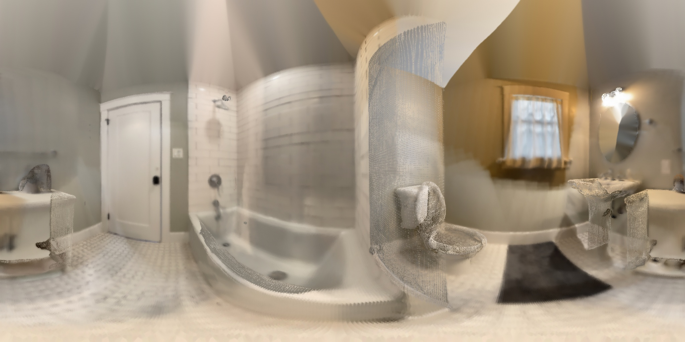

# Point Cloud Panorama Video Processing Toolkit

This project is a Python-based toolchain for generating spherical images and videos from point cloud data. It processes 3D point clouds, converts them into spherical (equirectangular) projections, and generates perspective videos with simulated camera movements.

Below is an example of the panorama generated by the tool:




Below is an example of the perspective view video generated by the tool:

[Perspective View Video](data/rotating_room_90.mp4)


---

## **Contents**

### 1. Files Overview

#### **1.1 `input.py`**
This file handles the creation and loading of point cloud data.
- **Key Functions:**
  - `example_point_cloud()`: Generates a synthetic 3D scene with ground planes, walls, and floating spheres.
  - `load_point_cloud(view=False)`: Loads a point cloud from a `.ply` file (e.g., `data/room.ply`) and optionally visualizes it using Open3D.

#### **1.2 `main.py`**
This is the main script that ties together the components of the project.
- **Steps:**
  1. Loads the point cloud (either synthetic or from a file).
  2. Converts the 3D point cloud into a spherical (equirectangular) image using the `PCDSphericalConverter` class.
  3. Saves the spherical image to a file.
  4. Generates a rotating video from the spherical image using the `SphericalVideoGenerator` class.
- **Outputs:**
  - A spherical image (e.g., `data/spherical_room.jpg`).
  - A rotating video (e.g., `data/rotating_room_90.mp4`).

#### **1.3 `pcd_spherical_converter.py`**
This file defines the `PCDSphericalConverter` class, which handles the transformation of 3D point cloud data into a spherical image.
- **Key Methods:**
  - `_initialize_spherical_grid()`: Creates a spherical coordinate grid for mapping.
  - `project_points(points_3d, colors)`: Projects 3D points onto a spherical surface to create an equirectangular image.
  - `process_point_cloud(points, colors, camera_position)`: Transforms the point cloud relative to a camera position, projects it, and interpolates missing areas in the spherical image.

**Mathematical Formula:**

- Coordinate Conversions
  - 3D Cartesian to Spherical Coordinates
    - For each point (x, y, z):
        ```
        r = √(x² + y² + z²)
        θ (theta) = arctan2(y, x)     # azimuthal angle
        φ (phi) = arccos(z/r)         # polar angle
        ```

  - Spherical Image Grid
    - For width W and height H:
        ```
        x = [0, 2π] → W pixels
        y = [0, π] → H pixels
        ```

    - Cartesian coordinates of unit sphere:
        ```
        x = sin(φ) * cos(θ)
        y = sin(φ) * sin(θ)
        z = cos(φ)
        ```
  

- Pixel Mapping

  - Spherical to Image Coordinates
    ```
    x_pixel = ((θ + π) / (2π)) * width
    y_pixel = (φ / π) * height
    ```

- Camera Transform
  - When camera position (cx, cy, cz) is provided:
    ```
    point_transformed = point - camera_position
    ```

- Image Processing
  - Holes in the projection are filled using Telea inpainting algorithm with radius 3.
  - Validity constraints:
    ```
    0 ≤ x_pixel < width
    0 ≤ y_pixel < height
    ```


#### **1.4 `spherical_video_generator.py`**
This file defines the `SphericalVideoGenerator` class, which generates perspective views and rotating videos from spherical images.
- **Key Methods:**
  - `get_perspective_view(yaw, pitch, fov, output_size)`: Generates a perspective projection (rectilinear view) for a given yaw, pitch, and field of view.
  - `generate_rotation_video(output_path, duration_seconds, fps, view_fov, output_size)`: Creates a rotating video by generating perspective views at different angles and stitching them into an `.mp4` video.

**Mathematical Formula:**


- Perspective Projection

  - Ray Direction Calculation
  - For an output image of size (W, H), normalized device coordinates (X, Y) are computed as:
    ```
    X = (x - W/2) / (W/2)  where x ∈ [0, W-1]
    Y = (y - H/2) / (H/2)  where y ∈ [0, H-1]
    Z = 1/tan(FOV/2)
    ```

- Rotation Matrices

  - Pitch Rotation (vertical)

    ```
    R_pitch = [
        [1,  0,           0          ],
        [0,  cos(pitch), -sin(pitch)],
        [0,  sin(pitch),  cos(pitch)]
    ]
    ```

  - Yaw Rotation (horizontal)
    ```
    R_yaw = [
        [ cos(yaw), 0, sin(yaw)],
        [ 0,        1, 0       ],
        [-sin(yaw), 0, cos(yaw)]
    ]
    ```

  - Combined rotation: R = R_yaw × R_pitch


- Spherical Mapping

  - Cartesian to Spherical Coordinates, for rotated points (x, y, z):
    ```
    θ (theta) = arctan2(x, z)
    φ (phi) = arctan2(√(x² + z²), y)
    ```

  - Spherical to Image Coordinates
    ```
    u = ((θ + π) / (2π)) × width
    v = (φ / π) × height
    ```

- 4. Color Interpolation

  - Bilinear interpolation weights:
    ```
    w_u = u - floor(u)
    w_v = v - floor(v)
    ```

  - Final color:
    ```
    C = (1-w_u)(1-w_v)C₀₀ + w_u(1-w_v)C₀₁ + (1-w_u)w_vC₁₀ + w_uw_vC₁₁
    ```

- Video Generation Parameters

  - Rotation Animation
    ```
    yaw = 2π × (frame/total_frames)  # Full 360° rotation
    pitch = sin(2π × frame/total_frames) × 0.3  # Oscillating vertical motion
    ```


### 2. How to Run the Project

#### **Prerequisites**
- Python 3.8+
- Required libraries:
  - `numpy`
  - `open3d`
  - `opencv-python`

Install the dependencies using:
```bash
pip install numpy open3d opencv-python
```

#### **Steps to Execute**
1. **Prepare the Input Data:**
   - Ensure a `.ply` file exists in the `data/` folder (e.g., `data/room.ply`).
   - Alternatively, use the synthetic point cloud generated by `example_point_cloud()` in `input.py`.

2. **Run the Main Script:**
   ```bash
   python main.py
   ```

3. **Outputs:**
   - Spherical Image: Saved as `data/spherical_room.jpg`.
   - Rotating Video: Saved as `data/rotating_room_90.mp4`.

---

### 3. Features

- **Synthetic Point Cloud Creation:**
  - Generates custom scenes with ground planes, walls, and spheres.

- **Spherical Image Generation:**
  - Converts 3D point clouds into equirectangular projections.

- **Rotating Video Generation:**
  - Produces smooth 360° rotating videos from spherical images with customizable field of view (FOV) and resolution.

---

### 4. Example Use Cases

- **Visualizing 3D Scenes:**
  - Convert complex 3D environments into panoramic images for immersive viewing.

- **Creating Virtual Tours:**
  - Generate videos simulating camera movement through scenes.

- **Training AI Models:**
  - Use spherical images/videos as datasets for computer vision or robotics research.

---

### 5. Troubleshooting

- **Missing `.ply` File:**
  - Ensure the file `data/room.ply` exists or use the synthetic point cloud by uncommenting `example_point_cloud()` in `main.py`.

- **Open3D Errors:**
  - Confirm Open3D is installed and compatible with your Python version.

- **Blurry or Incomplete Images:**
  - Verify the point cloud has sufficient points for spherical projection.
  - Adjust the `width` and `height` parameters in `PCDSphericalConverter` for higher resolution.

---

### 6. File Outputs

- **`spherical_room.jpg`:**
  - A spherical (equirectangular) projection of the input 3D scene.

- **`rotating_room_90.mp4`:**
  - A 360° rotating video generated from the spherical projection.

---

### 7. Customization

- **Change Video Resolution:**
  - Modify the `output_size` parameter in the `generate_rotation_video()` method in `main.py`.

- **Change Camera Settings:**
  - Update `camera_position` in `main.py` to alter the camera's viewpoint.

- **Modify Field of View:**
  - Adjust the `fov` parameter in the `generate_rotation_video()` method to change the perspective.

---

### 8. Directory Structure
```
project/
|— main.py                       # Main script to process and generate outputs
|— input.py                      # Handles point cloud creation and loading
|— pcd_spherical_converter.py    # Converts point cloud data into spherical projections
|— spherical_video_generator.py  # Generates perspective views and videos
|— data/                         # Contains input and output files
```

---

### 9. License
This project is distributed under the MIT License. Feel free to modify and use it in your own applications.

